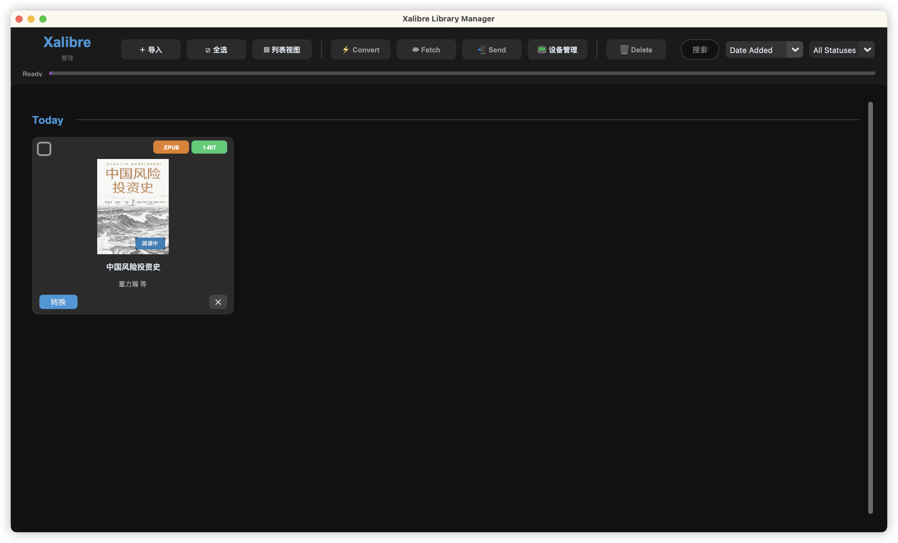
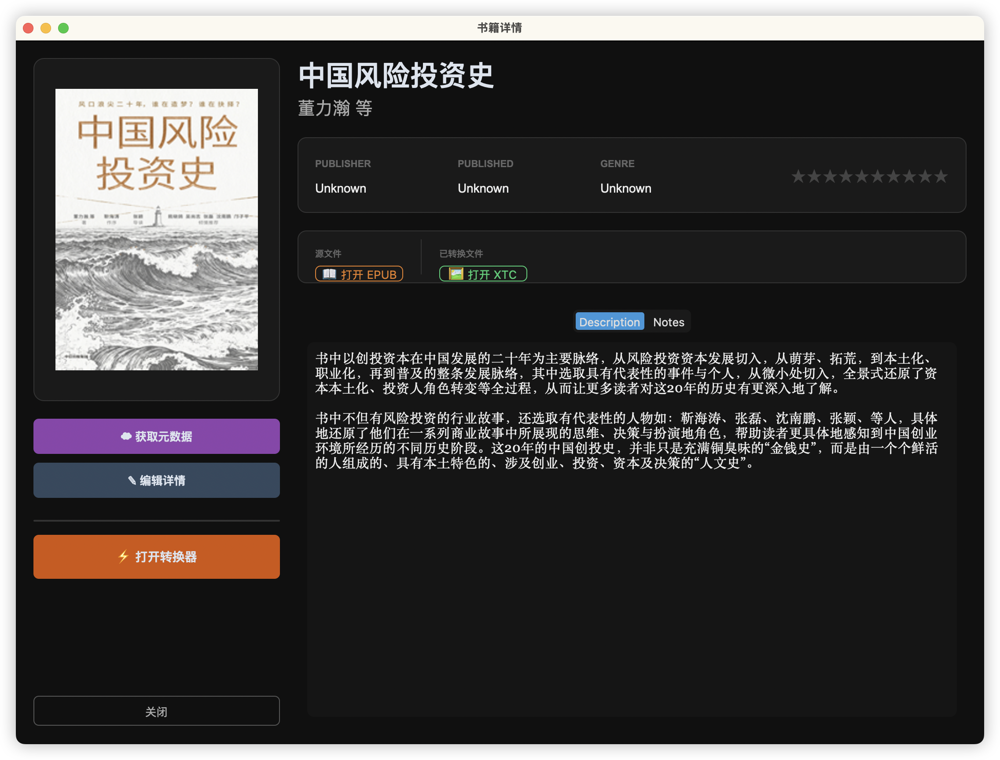
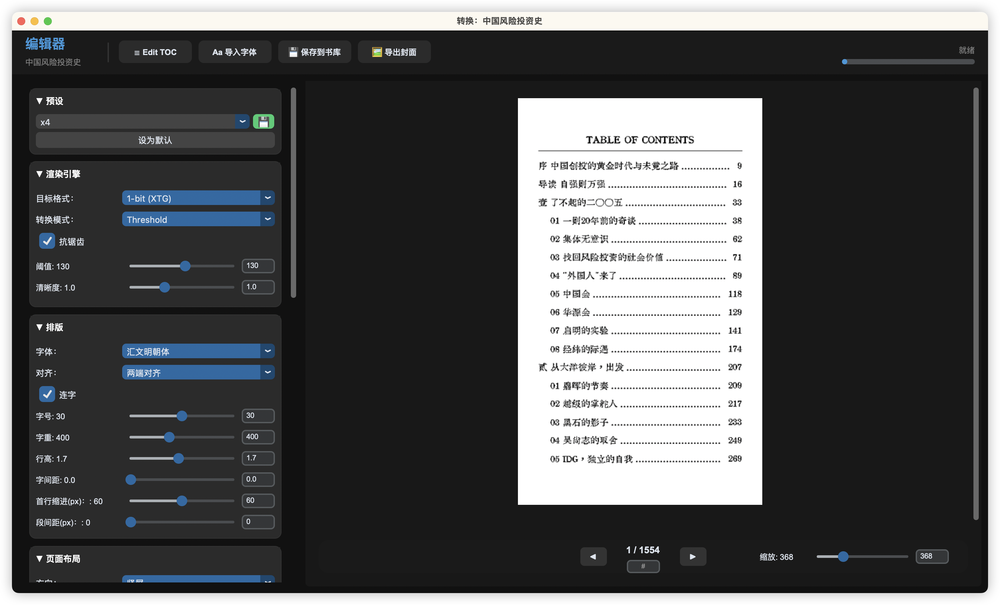

# Xalibre-zh · 汉化版

基于 **Xalibre** 的完整汉化版本：界面、转换器选项均为中文，并增加首行缩进、段间距、目录层级、抗锯齿等可调项，便于中文阅读与排版。

**Xalibre** 是面向电纸书的 EPUB 管理与转换工具，支持整理书库、抓取元数据、编辑书籍信息，并将 EPUB 转为 **XTC** 格式（适配 Xteink X4 等 e-ink 设备）。

---

## ✨ 功能概览

* **📚 书库管理**：本地 SQLite 书库，支持排序、筛选、搜索。
* **⚡ EPUB → XTC 转换**：转为 **1-bit** 或 **2-bit** 位图，针对 e-ink 优化。
* **🧠 Spectra AI**：类似 Word Wise，用 AI 分析难度并在难词上方显示释义/翻译。
* **📝 行内脚注**：将书末脚注提取并插入到引用段落后方框内。
* **☁️ 元数据抓取**：从 Google Books、Apple Books、Open Library 抓取书名、作者、封面。
* **🖱️ 拖拽导入/导出**：拖入导入书籍，从卡片拖出导出封面/EPUB/XTC 或整包。
* **📡 设备管理**：通过 Wi-Fi 连接 Xteink X4，浏览设备目录并上传书籍。

### 汉化与增强

* 主界面、设置、转换器侧栏与二级菜单（对齐、方向、页眉页脚等）均为中文。
* **排版**：首行缩进(px)、段间距(px)、字间距、行高、字号、字重等可调。
* **目录**：目录字号可调；支持一级/二级标题缩进区分（壹贰叁 / 01 02 03）。
* **渲染**：抗锯齿开关；段间距为 0 时与行高一致。
* **标题与作者**：标题下作者行居中、无多余空隙；正文两端对齐与 text-justify 优化。





---

## 🚀 使用说明

### 安装与运行

```bash
# 建议使用虚拟环境
python -m venv .venv
source .venv/bin/activate   # Windows: .venv\Scripts\activate
pip install -r requirements.txt
python Xalibre.py
```

* **首次运行**：会自动创建配置与书库目录（如 `~/Xalibre` 下的 Library、Exports、Presets、Fonts 等）。

### 书库

* **导入**：将 `.epub` 拖入窗口或点击 **「＋ 导入」**。
* **搜索**：右上角按书名/作者实时筛选。
* **视图**：网格 / 列表切换；卡片上可删除书籍或仅删除某格式（如只删 XTC）。

### 转换器（点击书籍后「⚡ 转换」）

* **渲染引擎**：目标格式 1-bit / 2-bit，转换模式 阈值 / 抖动；**抗锯齿** 可开关。
* **排版**：字体、对齐（两端对齐/左对齐）、字号、字重、行高、字间距、**首行缩进(px)**、**段间距(px)**。
* **页面布局**：方向、边距、目录插入页、**目录字号**。
* **页眉页脚**：章节标题、页码、进度条等位置与顺序（选项已汉化）。
* **预设**：可将当前设置保存为预设，便于一键套用。

### 设备与导出

* **设备管理**：点击 **「📟 设备管理」** 输入设备 IP，浏览并上传文件。
* **发送**：选中书籍后 **「📲 发送」**，支持 Wi-Fi 或导出到本地文件夹。
* **导出**：从卡片拖出封面图、EPUB 或 XTC 到本机；拖卡片背景可导出整包。

---

## ⚙️ 设置

点击左上角 **「Xalibre 书库」** 进入设置：书库路径、设备 IP、默认视图与排序等。

---

## 📄 许可与致谢

* 汉化与增强由社区维护；原项目为 Xalibre。
* 字体目录内含第三方字体（如 Atkinson Hyperlegible、Literata），请遵守各自 OFL 等许可。
